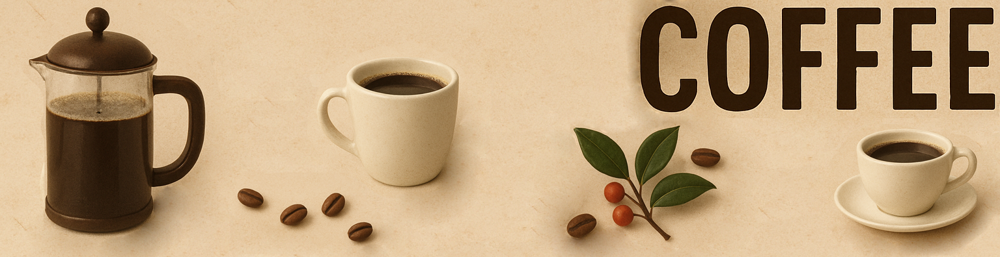

# Analyze Data with Python
Codecademy Portfolio project

#### Overview
This project is part of the Codecademy Portfolio Project "Analyze Data with Python", where I'll be using the Global Coffee Health Dataset, which contains information on coffee consumption, sleep patterns, and health outcomes worldwide.
I hope to answer some questions such as:
 - How are sleep patterns affected by coffee consumption?
 - Is there a link between coffee intake and health risks?
 - Is there a link between drinking coffee and smoking?

Library dependencies used: 
Python (3.13.5) 
numpy: 2.3.2 
pandas: 2.3.2 
scipy: 1.16.2 
matplotlib: 1.17.0
   
#### Project Objectives
 - Create a project for a data science portfolio using Jupyter Notebook
 - Clean and prepare data using pandas for exploration and analysis
 - Create meaningful visualizations using MatPlotLib
 - Use hypothesis tests to statistically support your findings
 - Report key findings and actionable insights

#### Dataset
The dataset is available on [kaggle](https://www.kaggle.com/datasets/uom190346a/global-coffee-health-dataset/data)
It contains 10000 records about coffee consumption, sleep behaviour, and health outcomes across 20 countries.

#### About the Dataset
The Dataset consists of 16 columns and 10000 rows.
The columns are:
|Column|Type|Description|
|---|---|---|
|ID|Integer|Unique record ID (1–10000)|
|Age|Integer|Age of participant (18–80 years)|
|Gender|Categorical|Male, Female, Other|
|Country|Categorical|Country of residence (20 countries)|
|Coffee_Intake|Float|Daily coffee consumption in cups (0–10)|
|Caffeine_mg|Float|Estimated daily caffeine intake in mg (1 cup ≈ 95 mg)|
|Sleep_Hours|Float|Average hours of sleep per night (3–10 hours)|
|Sleep_Quality|Categorical|Poor, Fair, Good, Excellent (based on sleep hours)|
|BMI|Float|Body Mass Index (15–40)|
|Heart_Rate|Integer|Resting heart rate (50–110 bpm)|
|Stress_Level|Categorical|Low, Medium, High (based on sleep hours and lifestyle)|
|Physical_Activity_Hours|Float|Weekly physical activity (0–15 hours)|
|Health_Issues|Categorical|None, Mild, Moderate, Severe (based on age, BMI, and sleep)|
|Occupation|Categorical|Office, Healthcare, Student, Service, Other|
|Smoking|Boolean|0 = No, 1 = Yes|
|Alcohol_Consumption|Boolean|0 = No, 1 = Yes|

#### Index
1. Initial Insights
2. Demographics
   1. Coffee Consumption by Gender
   2. Coffee Consumption by Age
   3. Coffee Consumption by Country
   4. Coffee Consumption by Occupation
3. Correlations
   1. Coffee Consumption Correlations
   2. Sleep Quality Correlations
   3. Health Issues Correlations
4. Hypothesis Tests
   1. Is Coffee Consumption Related to Hours Slept?
   2. Does Coffee Consumption Affect Sleep Quality?
   3. Does Coffee Consumption Have Any Effect On Stress Level?
   4. Is Coffee Consumption Correlated to Health Issues?
   5. Does Smoking Or Drinking Alcohol Impact Coffee Consumption?
   6. Does Physical Activity Affect Sleep Quality?
   7. Is Sleep Quality Related to Stress Levels or Health Issues?
5. Conclusion

#### Conclusion
Working on this assignment has been fun and insightful, and I found out some interesting facts about coffee consumption and some new approaches and methods to work with data. 
The data in the dataset was very symmetrical, with similar representatives across most categories, such as having close percentages from both natural genders, from all countries, and from all occupations. 
I was very surprised to find out that the average coffee intake is quite similar across all demographics, at 2.5 cups per day, as I would have assumed different countries, and possibly even different occupations, would yield different averages. 
From analyzing the plots and the Hypothesis tests, I was able to make some discoveries:
 - Coffee intake affects the hours of sleep, sleep quality, and stress level.
 - The quantity of coffee drunk seems to be related to health issues, but contrary to what I was expecting, people with no issues drink more coffee on average than people with mild or moderate health issues, possibly indicating a correlation that coffee might affect health for the positive up to a certain point, but more research would be necessary.
 - There is no statistically significant difference to say that smoking or drinking alcohol is related to the amount of coffee drunk.
 - Physical activity does impact sleep quality, but not enough to be relevant, another fact that surprised me, as I was expecting the people that report more physical activity to have much better sleep quality than those with less physical activity.
 - Sleep quality is heavily impacted by stress levels and health issues, but of course, there might be other factors weighing in on sleep quality as well.
